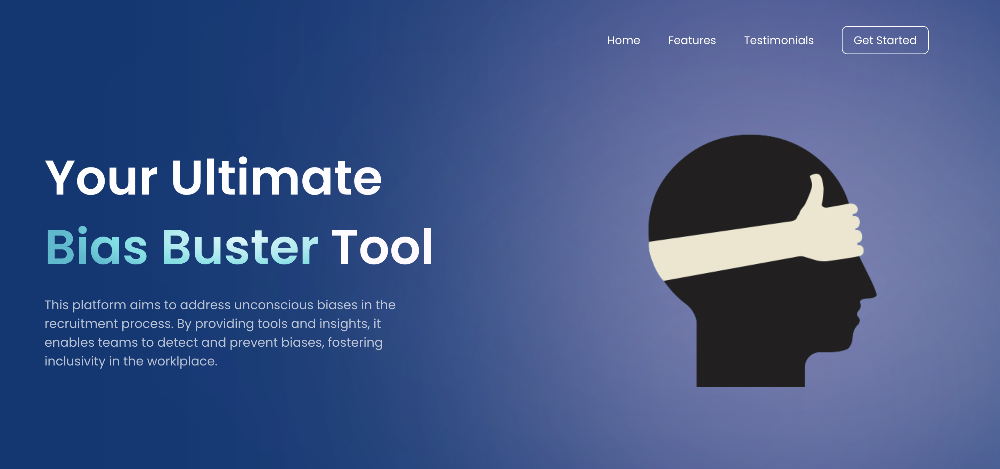

# Credit Suisse - INSPIRE Women in Technology 2023

## Introduction

Welcome to Your Ultimate Bias Buster Tool, an individual full-stack MERN project developed as part of the 10-week INSPIRE mentorship programme. This platform aims to address unconscious biases in the recruitment process by providing tools and insights to detect and prevent biases, fostering inclusivity in the talent acquisition process.  

Here is the [link](https://drive.google.com/file/d/1QkahnrmyePPiqdBYrjlu7OELSiSwkJnK/view?usp=sharing) to the demo of this app. Do note that the video does not contain any audio.

## Features

- **Personalized Toolkits:** Customized resources to understand biases and develop an inclusive mindset.
- **Interactive Exploration:** Personalized reading suggestions to deepen knowledge on unconscious biases.
- **Discussion Platform:** Community-driven discussions for sharing experiences and fostering inclusive dialogue.

## Prerequisites

Before you can run the server and client, please make sure you have the following installed on your machine:

- Node.js (v14 or later)
- npm (Node Package Manager)

## Installation

1. Clone this repository to your local machine.
2. Open a terminal and navigate to the project directory.
3. Install the dependencies for the server:
    - cd server
    - npm install
4. Install the dependencies for the client:
    - cd ../client
    - npm install

## Usage

To start the server and client in separate terminals:

1. Open a terminal and navigate to the server folder.
2. Run the following command:
    - npm start

The server will start running on `http://localhost:3000`.

3. Open another terminal and navigate to the project directory.
4. Start the client:
    - cd client
    - npm run dev

The client will be served on `http://localhost:5173`.

## Contributing

As there is still much potential for future work, contributions to make this platform even better are welcome. If you'd like to contribute, please follow these steps:

1. Fork the repository.
2. Create a new branch for your feature or bug fix.
3. Make the necessary changes and commit your code.
4. Push the changes to your forked repository.
5. Submit a pull request to the main repository.

## Acknowledgments

I would like to express my sincere gratitude to my mentor, Peter, for his invaluable guidance and expertise throughout this project, as well as my buddy, Bernadine, for her continuous support and encouragement. I am thankful for the opportunity to learn from both of you!

